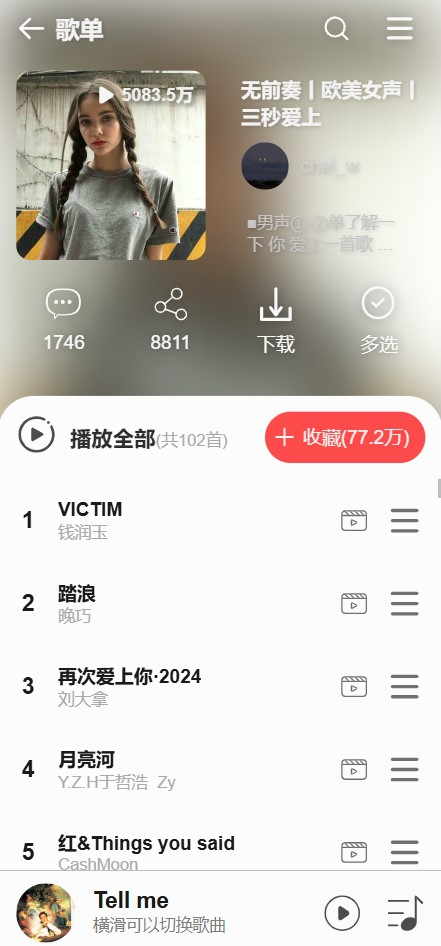
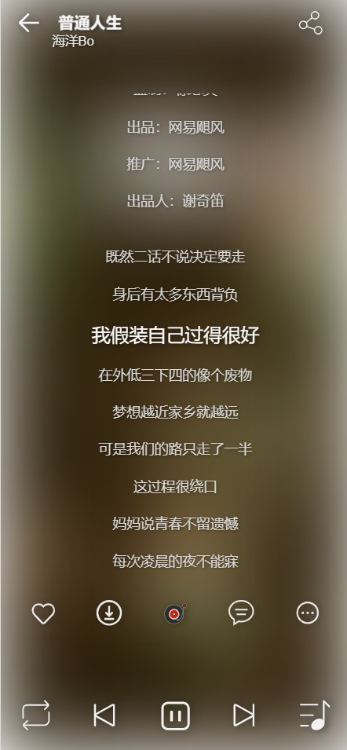

# wangyiyun-app

## 项目简介
该项目仿网易云移动端，是一个基于 Vue CLI 搭建的 Vue 应用。通过使用 Vant 组件库，快速构建出美观且响应式的用户界面，为用户提供流畅的使用体验。


  
  
  
  
```
npm install
```

### Compiles and hot-reloads for development
```
npm run serve
```

### Compiles and minifies for production
```
npm run build
```

### Customize configuration
See [Configuration Reference](https://cli.vuejs.org/config/).
# -
